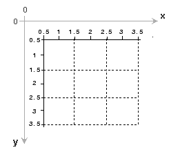

# Computer Vision Notes

Görüntülerin koordinat ekseninde **x** ve **y** konumları aşağıdaki gibi olur;



## Resmi İçe Aktarma

```python
import cv2

#ice aktarma
img = cv2.imread("1_Open_Image\messi5.jpg", 0)

#Gorsellestirme
cv2.imshow("ilk resim", img)
k = cv2.waitKey(0) &0xFF #klavyeden tus al

if k == 27: #esc ise
    cv2.destroyAllWindows() #pencereleri kapat
elif k == ord("s"): #s ise
    cv2.imwrite("messi_gray.png", img) #kaydet
    cv2.destroyAllWindows() #pencereleri kapat
```

## Video İçe Aktar

```python
import cv2
import time

video_name = "MOT17-04-DPM.mp4"

# Video ice aktar
cap = cv2.VideoCapture(video_name)

# Video kontrol
if cap.isOpened() == False:
    print("Path Error")

# Videonun genislik ve yuksekligi
print("Width: ", cap.get(3))
print("Height: ", cap.get(4))
```

### **Video Okuma**

`cap.read(path)` fonksiyonu ile video okunur ve bu fonksiyon 2 değer döndürür. `ret` ve `frame` .

`ret` video okuma işleminin başarılı olduğu durumda `true`, başarısız olduğu durumda ise `false` değeri alır.

`frame` ise video okuma işlemi başarılı olduğunda videonun içerisinde bulunan her bir frame'i alır.

```python
# Video okuma
while True:
    ret, frame = cap.read()
    
    if ret == True:
        #uyari: goruntulerin yavas akmasi icin
        time.sleep(0.01) 
        
        cv2.imshow("video", frame)
    else: break

    # "q" tusuna basildiginda döngüden cik
    if cv2.waitKey(1) & 0xFF == ord("q"):
        break

# videoyu serbest birak
cap.release()

#tum acik pencereleri kapat
cv2.destroyAllWindows()
```

## Kamera Açma ve Video Kaydı

```python
import cv2

# capture
cap = cv2.VideoCapture(0)

# Videonun frame genisligi ve yuksekligini al
width = int(cap.get(cv2.CAP_PROP_FRAME_WIDTH))
height = int(cap.get(cv2.CAP_PROP_FRAME_HEIGHT))

print(width,  height)

# video kaydet
# cv2.VideoWriter_fourcc(*"DIVX")
# frame'leri sikistirmak icin kullanilan codec kodu
# fps = 20
writer = cv2.VideoWriter("video_kaydi.mp4", 
                         cv2.VideoWriter_fourcc(*"DIVX"),
                         20, (width, height))
while True:
    ret, frame = cap.read()
    cv2.imshow("video", frame)
    
    # save
    writer.write(frame)
    
    if cv2.waitKey(1) & 0xFF == ord("q"): break

cap.release()
writer.release()
cv2.destroyAllWindows()
```

## Yeniden Boyutlandır ve Kırp

Görüntü işleme projelerinde 1080x1080 boyutlu bir görüntü yerine 480x480 boyutlu bir görüntü ile çalışmak çok daha performanslı ve kolay olacaktır. Bu nedenle çalıştığımız verileri yeniden boyutlandırma veya kırpmaya ihtiyaç duyarız.

### **Yeniden Boyutlandırma**

```python
import cv2

# resmi oku
img = cv2.imread("lenna.png", 0)
print("Image size: ", img.shape)

cv2.imshow("Orginal", img)
if cv2.waitKey(0) & 0xFF == ord("q"): 
    cv2.destroyAllWindows()
```

lenna.png'nin siyah beyaz boyutuna baktığımızda `Image size: (512, 512)` çıktısı alırız.


Renkli boyutuna baktığımızda ise `Image size: (512, 512, 3)` çıktısı elde ederiz. Buradaki 3 boyutu, 3 farklı renk olduğu için oluşur. Red, Green ve Blue.


Görüntünün boyutunu (800, 800) boyutuna büyütelim;

```python
# yeniden boyutlandir
imgResized = cv2.resize(img, (800,800))
print("Resized image shape: ", imgResized.shape)

cv2.imshow("Resized Image", imgResized)
```


### **Kırpma**

y ekseninde 200. , x ekseninde 300. piksele kadar görüntüyü kırpalım;

```python
# kırp
imgCropped = img[:200, 0:300]

cv2.imshow("Cropped Image", imgCropped)
```


## Şekiller ve Metin

Bir nesne tespiti yaptığımız zaman görüntü üzerine kutucuk çizmemiz, yazı yazmamız gerekebiliyor. Bu nedenle görüntü üzerine şekil ve metin eklemeye ihtiyaç duyuluyor.

### Çizgi Ekleme

```python
import cv2
import numpy as np

# siyah resim olustur
img = np.zeros((512, 512, 3), np.uint8)
print(img.shape)

#line ekleme
cv2.line(img,       #resim
         (0,0),     #baslangic noktasi
         (512,512), #bitis noktasi
         (0,255,0), #renk
         3, )       #kalinlik
         
cv2.imshow("line", img)

if cv2.waitKey(0):
    cv2.destroyAllWindows()
```


### Dikdörtgen Ekleme

```python
#dikdortgen ekleme
cv2.rectangle(img,       #resim
         (0,0),          #baslangic noktasi
         (256,256),      #bitis noktasi
         (255,200,0),    #renk
         3, )            #kalinlik
```


### Dikdörtgen Doldurma

```python
#dikdortgen ekleme
cv2.rectangle(img,       #resim
         (0,0),          #baslangic noktasi
         (256,256),      #bitis noktasi
         (255,200,0),    #renk
         cv2.FILLED)     #doldurma
```


### Çember Çizimi

```python
#cember cizimi
cv2.circle(img,         #resim
           (300,300),   #merkez
           45,          #yaricap
           (0,0,255),   #renk
           )

cv2.imshow("circle", img)
```


### **Çember Doldurma**

```python
#cember cizimi
cv2.circle(img,         #resim
           (300,300),   #merkez
           45,          #yaricap
           (0,0,255),   #renk
           cv2.FILLED   #doldurma
           )
```


### **Metin Ekleme**

```python
#Metin ekleme
cv2.putText(img,                       #resim
            "TEXT",                    #text
            (350,350),                 #baslangic noktasi
            cv2.FONT_HERSHEY_COMPLEX,  #font
            1.5,                       #kalinlik
            (255,255,255))             #renk

cv2.imshow("text", img)
```


## Görüntü Birleştirme

```python
import cv2
import numpy as np

#resmi ice aktar
img = cv2.resize(cv2.imread("lenna.png"),(256,256))

cv2.imshow("original", img)

#horizontal (yatay) birleştirme
hor = np.hstack((img,img))
cv2.imshow("horizontal", hor)
```


```python
#vertical (dikey) birleştirme
ver = np.vstack((img,img))
cv2.imshow("vertical", ver)

cv2.waitKey(0)
cv2.destroyAllWindows()
```


## Perspektif Çarpıtma (Warp Perspective)

Point1 ve Point2 belirlememiz gerekiyor. Point1'de yamuk resmimizin köşelerinin piksel değerleri yer alacak. Görüntüyü Paint ile açtığımızda sol alt köşede imlecin yer aldığı pikselin değerleri gözükmekte.


Sol üst köşeden başlayıp  köşeleri dolaştığımızda sırasıyla köşe noktaların koordinatları;

- (204,3) - sol üst
- (2,474) - sol alt
- (540,147) - sağ üst
- (340,617) - sağ alt

olarak belirlendi.

Point2 olarak ise dönüştürmek istediğimiz yeni köşe koordinatlarını belirlememiz gerekiyor.

`cv2.getPerspectiveTransform()` fonksiyonu ile iki noktayı verdikten sonra transform için gerekli olan matrix otomatik olarak oluşturulmuş olacak.

```python
import cv2
import numpy as np

img = cv2.imread("kart.png")

cv2.imshow("original", img)

width = 400
height = 500

#cevirmek istenilen koseler
pts1 = np.float32([[204,3],[2,474],[540,147],[340,617]])

pts2 = np.float32([[0,0],[0, height],[width,0],[width,height]])

matrix = cv2.getPerspectiveTransform(pts1, pts2)

# nihai donusturulmus resim
imgOutput = cv2.warpPerspective(img, matrix, (width,height))

cv2.imshow("nihai resim", imgOutput)

cv2.waitKey(0)
cv2.destroyAllWindows()
```


## Görüntüleri Karıştırmak (Blending)

İki görüntüyü alpha ve beta katsayıları ile birbirine karıştıralım;


```python
import cv2
import matplotlib.pyplot as plt

img1 = cv2.imread("img1.JPG")
img1 = cv2.cvtColor(img1, cv2.COLOR_BGR2RGB)
img2 = cv2.imread("img2.JPG")
img2 = cv2.cvtColor(img2, cv2.COLOR_BGR2RGB)

plt.figure()
plt.imshow(img1)

plt.figure()
plt.imshow(img2)

#birlestirmek icin shape'ler aynı boyutta olmak zorunda
print(img1.shape)
print(img2.shape)

img1 = cv2.resize(img1, (600,600))
print(img1.shape)

img2 = cv2.resize(img2, (600,600))
print(img2.shape)

plt.figure()
plt.imshow(img1)

plt.figure()
plt.imshow(img2)

#karistirilmis resim = alpha*img1+beta*img2
blended=cv2.addWeighted(src1=img1, alpha=0.5,
                        src2=img2, beta=0.5,
                        gamma=0)
plt.figure()
plt.imshow(blended)
```


## Görüntü Eşikleme

Görüntülerdeki siyaha yakın pikseller 0'a yakın, beyaza yakın pikseller ise 255'e yakın değerler alır. Bu değerler ile görüntü eşikleme yöntemi uygulanarak görüntüdeki detaylar yok edilebilir ve ana hat elde edilebilir.

Örneğin görüntüdeki 60 değerine threshold uygulandığından aşağıdaki gibi sonuç elde edilir;

```python
import cv2
import matplotlib.pyplot as plt

img = cv2.imread("img1.jpg")
img = cv2.cvtColor(img, cv2.COLOR_BGR2GRAY)
# %matplotlib auto
plt.figure()
plt.imshow(img, cmap = "gray")
plt.axis("off")
plt.show()

#esikleme

_, thresh_img = cv2.threshold(img, thresh=60, maxval=255,
                              type=cv2.THRESH_BINARY)
#THRESH_BINARY_INV ile tam tersi yapilabilir
plt.figure()
plt.imshow(thresh_img, cmap="gray")
plt.axis("off")
plt.show()
```


Görüntüde bir bütün olan alanlar var, örneğin dağ, ağaç vs gibi. Threshold uygulanırken bu nesnelerin bölünmesi istenmeyebilir. Ya tamamı kaldırılmak istenir ya da tamamı dursun istenir. Bunun çözümü `adaptive threshold` yöntemidir.

```python
#Adaptive Threshold
thresh_img2 = cv2.adaptiveThreshold(img, 255, 
                                       cv2.ADAPTIVE_THRESH_MEAN_C,
                                       cv2.THRESH_BINARY,
                                       11, 8)

plt.figure()
plt.imshow(thresh_img2, cmap="gray")
plt.axis("off")
plt.show()
```


## Bulanıklaştırma (Blurring)


### Ortalama Bulanıklaştırma


```python
import cv2
import matplotlib.pyplot as plt
import numpy as np

# blurring(detayi azaltmak icin)
img = cv2.cvtColor(cv2.imread("10_blurring/NYC.jpg"), cv2.COLOR_BGR2RGB)

plt.figure(),plt.imshow(img),plt.axis("off")
plt.title("original")

# Ortalama bulaniklastirma ornegi
dst2 = cv2.blur(img, ksize=(3,3))
plt.figure(), plt.imshow(dst2), plt.axis("off")
plt.title("Mean Blurring"), plt.show()
```


### Gaus Bulanıklaştırma


```python
#Gaussian blur ornegi
gb = cv2.GaussianBlur(img, ksize=(3,3), sigmaX=7)
plt.figure(), plt.imshow(gb), plt.axis("off")
plt.title("Gaussian Blur"), plt.show()
```


### Medyan Bulanıklaştırma


```python
# Medyan blur ornegi
mb = cv2.medianBlur(img, ksize=3)
plt.figure(), plt.imshow(mb), plt.axis("off")
plt.title("Median Blur"), plt.show()
```


Filtrelerin işe yaradığını daha iyi görmek için görüntü üzerinde noise oluşturabiliriz;

```python
#Noise eklenebilmesi icin goruntunun 0-1 arasi normalize edilmesi gerekir
img = cv2.cvtColor(cv2.imread("10_blurring/NYC.jpg"),
                    cv2.COLOR_BGR2RGB)/255 #normalize edilmis goruntu

plt.figure(), plt.imshow(img), plt.axis("off")
plt.title("Normalized Image")

gaussianNoisyImage = gaussianNoise(img)
plt.figure(), plt.imshow(gaussianNoisyImage), plt.axis("off")
plt.title("gaussianNoisyImage"), plt.show()
```


### Gaussian Blur ile Noise Azaltma

```python
#gauss blur
gb2 = cv2.GaussianBlur(gaussianNoisyImage, ksize=(3,3), sigmaX=7)
plt.figure(), plt.imshow(gb2), plt.axis("off")
plt.title("with Gaussian Blur"), plt.show()
```


### Salt Paper Noise

```python
# salt pepper noise
def saltPepperNoise(image):

    row, col, ch = image.shape
    s_vs_p = 0.5
    amount = 0.004 #beyaz nokta sayisini belirler

    noisy = np.copy(image)

    # salt
    num_salt = np.ceil(amount*image.size*s_vs_p)
    coords = [np.random.randint(0, i-1, int(num_salt)) for i in image.shape]
    noisy[coords] = 1

    # pepper
    num_pepper = np.ceil(amount*image.size*(1-s_vs_p))
    coords = [np.random.randint(0, i-1, int(num_pepper)) for i in image.shape]
    noisy[coords] = 0

    return noisy

spImage = saltPepperNoise(img)
plt.figure(), plt.imshow(spImage), plt.axis("off")
plt.title("SaltPepper Noise"), plt.show()
```


`medianBlur()` ile noise azaltma işlemi uygulayalım;

```python
mb2 = cv2.medianBlur(spImage.astype(np.float32), ksize=3)
plt.figure(), plt.imshow(mb2), plt.axis("off")
plt.title("with median Blur"), plt.show()
```


## Morfolojik (Morphological) Operasyonlar


### Erozyon (Erode)


Sınırları belirlememiz için ilk önce bir kutucuk belirlememiz gerekiyor, bu kutucuk resmi dolaşacak ve sınırları belirleyecek.

```python
import cv2
import matplotlib.pyplot as plt
import numpy as np

img = cv2.imread("11_morphological/datai_team.jpg")
plt.figure(), plt.imshow(img), plt.axis("off")
plt.title("original")

# Erozyon
kernel = np.ones((5,5), dtype=np.uint8)
# iterations: kac kez erozyon yapilacak
result = cv2.erode(img, kernel, iterations=1)

plt.figure(), plt.imshow(result), plt.axis("off")
plt.title("Erode"), plt.show()
```


### Genişleme (Dilation)


```python
#Dilation
result2 = cv2.dilate(img, kernel, iterations=1)
plt.figure(), plt.imshow(result2), plt.axis("off")
plt.title("Dilate"), plt.show()
```


### Açma (Opening)


Beyaz gürültünün giderilmesinde kullanılır. Beyaz gürültü oluşturulması;

```python
# White Noise
whiteNoise = np.random.randint(0,2, #0-1 arasinda
                            img.shape[:2]) #ch dahil degil
whiteNoise = whiteNoise*255
plt.figure(), plt.imshow(whiteNoise, cmap="gray"), plt.axis("off")
plt.title("WhiteNoise")

noise_img = whiteNoise+img
plt.figure(), plt.imshow(noise_img, cmap="gray"), plt.axis("off")
plt.title("Noise Img")

plt.show()
```


Opening işlemi;

```python
#Açılma (Opening)
opening = cv2.morphologyEx(noise_img.astype(np.float32), cv2.MORPH_OPEN, kernel)

plt.figure(), plt.imshow(opening, cmap="gray"), plt.axis("off")
plt.title("Opening")
```


### Kapatma


Kapatma işlemi siyah noise'ları yok etmek için kullanılır. Black noise oluşturma;

```python
#Black Noise
blackNoise = np.random.randint(0,2, #0-1 arasinda
                            img.shape[:2]) #ch dahil degil
blackNoise = blackNoise*-255
plt.figure(), plt.imshow(blackNoise, cmap="gray"), plt.axis("off")
plt.title("BlackNoise")

blackNoise_img = blackNoise+img
blackNoise_img[blackNoise_img<=245]=0

plt.figure(), plt.imshow(blackNoise_img, cmap="gray"), plt.axis("off")
plt.title("BlackNoise Image")
```


Closing işlemi;

```python
#Kapatma (Closing)
closing = cv2.morphologyEx(noise_img.astype(np.float32), cv2.MORPH_CLOSE, kernel)

plt.figure(), plt.imshow(closing, cmap="gray"), plt.axis("off")
plt.title("Closing")

plt.show()
```


### Morfolojik Gradyan


Kenar tespiti problemlerinin temel yöntemlerinden birisidir.

```python
#Morphological Gradient
gradient = cv2.morphologyEx(img.astype(np.float32), cv2.MORPH_GRADIENT, kernel)

plt.figure(), plt.imshow(gradient, cmap="gray"), plt.axis("off")
plt.title("Gradient")
plt.show()
```


## Gradyanlar (Gradients)


X ve Y eksenlerindeki kenarların tespiti;

```python
import cv2
import numpy as np
import matplotlib.pyplot as plt

img = cv2.imread("12_gradients/sudoku.jpg", 0)

plt.figure(), plt.imshow(img, cmap="gray"), plt.axis("off")
plt.title("Original")

# x eksenindeki gradyanlar (dikey kenarlar)
sobelx = cv2.Sobel(img, ddepth=cv2.CV_16S, dx=1, dy=0, ksize=5)

plt.figure(), plt.imshow(sobelx, cmap="gray"), plt.axis("off")
plt.title("sobelx")

# y eksenindeki gradyanlar (yatay kenarlar)
sobely = cv2.Sobel(img, ddepth=cv2.CV_16S, dx=1, dy=0, ksize=5)

plt.figure(), plt.imshow(sobely, cmap="gray"), plt.axis("off")
plt.title("sobely")
```


Her iki eksendeki kenarları da Laplacian yöntemi ile tespit edebiliriz;

```python
#Laplacian gradient
laplacian = cv2.Laplacian(img, ddepth=cv2.CV_16S)
plt.figure(), plt.imshow(laplacian, cmap="gray"), plt.axis("off")
plt.title("laplacian")
```


## Histogramlar


Kırmızı ve maviden oluşan bir resimde histogram incelendiğinde piksellerin yarısının mavi değeri 255 ve kırmızı değerinin 0, diğer yarısının ise kırmızı değerinin 255 ve mavi değerinin 0 olacağı gözlemlenir. Yeşil renk ise tüm piksellerde 0 değerindedir çünkü hiç yeşil renk bulunmamaktadır.

```python
import cv2
import matplotlib.pyplot as plt
import numpy as np

img = cv2.imread("13_histogram/red_blue.jpg")
img_vis = cv2.cvtColor(img, cv2.COLOR_BGR2RGB)

plt.figure(), plt.imshow(img_vis), plt.axis("off")
plt.title("original")

print(img.shape)

img_hist = cv2.calcHist([img], channels=[0], mask=None, histSize=[256], ranges=[0,256])
print(img_hist.shape)
plt.figure(), plt.plot(img_hist)

color = ("b", "g", "r")
plt.figure()
for i, c in enumerate(color):
    hist = cv2.calcHist([img], channels=[i], mask=None, histSize=[256], ranges=[0,256])
    plt.plot(hist, color=c)
plt.show()
```


Farklı görüntüler ile histogram örnekleri;

Golden Gate resminden bir kısmı kolay incelemek için maskeleyip kırpalım;

### Mask

```python
# Golden Gate Ornegi
golden_gate = cv2.imread("13_histogram/goldenGate.jpg")
golden_gate_vis = cv2.cvtColor(golden_gate, cv2.COLOR_BGR2RGB)

plt.figure(), plt.imshow(golden_gate_vis), plt.axis("off")
plt.title("GoldenGate")

print(golden_gate.shape)

#goruntu boyutunda maske olusturma
mask = np.zeros(golden_gate.shape[:2], np.uint8)

#belirli bir alan disinda tum pikselleri beyaz yap
mask[1500:2000, 1000:2000] = 255
plt.figure(), plt.imshow(mask, cmap="gray"), plt.title("mask")

masked_img_vis = cv2.bitwise_and(golden_gate_vis,golden_gate_vis,mask=mask)
plt.figure(), plt.imshow(masked_img_vis, cmap="gray"), plt.title("mask")

masked_img = cv2.bitwise_and(golden_gate,golden_gate,mask=mask)

plt.show()
```


### Histogram Oluşturma

```python
#histogram olusturma
masked_img_hist_red = cv2.calcHist([masked_img], channels=[2], mask=mask, histSize=[256], ranges=[0,256])
plt.figure(),plt.title("masked_img_hist_red"), plt.plot(masked_img_hist_red)
masked_img_hist_green = cv2.calcHist([masked_img], channels=[1], mask=mask, histSize=[256], ranges=[0,256])
plt.figure(),plt.title("masked_img_hist_green"), plt.plot(masked_img_hist_green)
masked_img_hist_blue = cv2.calcHist([masked_img], channels=[0], mask=mask, histSize=[256], ranges=[0,256])
plt.figure(),plt.title("masked_img_hist_blue"), plt.plot(masked_img_hist_blue)

color = ("b", "g", "r")
plt.figure()
for i, c in enumerate(color):
    masked_img_hist = cv2.calcHist([masked_img], channels=[i], mask=mask, histSize=[256], ranges=[0,256])
    plt.plot(masked_img_hist, color=c)

plt.show()
```


### Histogram Eşitleme (Equalization)

Kontrastı arttırmamızı sağlar.


Yukarıdaki gibi soluk renkli bir görüntüde kontrastı arttırarak anlaşılabilirliği, detayları daha da ortaya çıkarabiliriz.

Renkler arasındaki kontrastı arttırarak 0-255 aralığını daha iyi kullanmak hedeflenir.


120-200 arasına sıkışan dar bölgeyi 0-255 aralığına genişlettik.